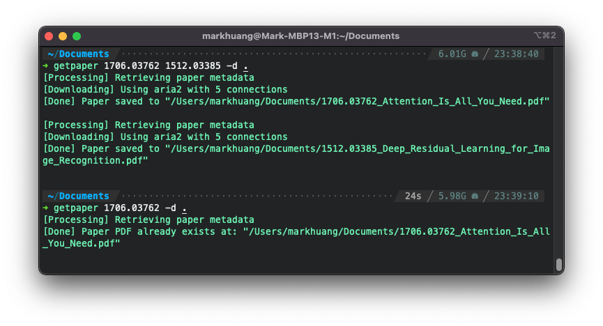

# arXiv-dl

Command-line [ArXiv](https://arxiv.org/) & [CVF Open Access](https://openaccess.thecvf.com/menu) Paper Downloader.
[[PyPI]](https://pypi.org/project/arxiv-dl/)
[[Source]](https://github.com/MarkHershey/arxiv-dl)

[](https://pypi.org/project/arxiv-dl/)
[](https://pypi.org/project/arxiv-dl/)
[](https://github.com/MarkHershey/arxiv-dl/releases)
[](https://pypistats.org/packages/arxiv-dl)
[](https://github.com/MarkHershey/arxiv-dl/blob/master/LICENSE)
[](https://github.com/psf/black)

_Disclaimer: This is a highly-opinionated CLI tool for downloading papers. It priorities ease of use for researchers. Obviously, this is not an official project._

## Features

-   Download papers from via simple command line interface.
-   Support papers from [ArXiv](https://arxiv.org/) and [CVPR, ICCV, WACV](https://openaccess.thecvf.com/menu).
-   Support downloading speedup by using [aria2c](https://aria2.github.io/).
-   Automatically maintain a local list of downloaded papers.
-   Retrieve the paper's metadata and citation:
    -   Paper Title
    -   Authors
    -   Abstract
    -   Comments (Conference acceptance info)
    -   Source Code Links
    -   Citation (`BibTeX`)
-   Configure the desired download destination via environment variables.
-   All downloaded papers will be named by its arXiv ID and paper title without whitespace.

### Why?

-   Save time and effort to download, rename, and organize papers.
-   Speedup downloading process by using parallel connections.
-   Local paper list would be handy for quick local lookup, locate, and cite papers.

## Install

This is a command-line tool, use `pip` to install the package globally.

-   Pre-requisite: `Python 3.x`

```bash
python3 -m pip install --upgrade arxiv-dl
```

(Optional) Install [aria2c](https://aria2.github.io/) for download speedup.

-   MacOS: `brew install aria2`
-   Linux: `sudo snap install aria2c`

## Usage

After installation, the command `getpaper` should be available in your terminal.

```bash
$ getpaper [-h] [-v] [-p] [-d DOWNLOAD_DIR] [-n N_THREADS] urls [urls ...]
```

Options:

-   `-v`, `--verbose` (optional): Print paper metadata.
-   `-p`, `--pdf_only` (optional): Download PDF only without creating Markdown notes
-   `-d`, `--download_dir` (optional): Specify one-time download directory. This option will override the default download directory or the one specified in the environment variable `ARXIV_DOWNLOAD_FOLDER`.
-   `-n`, `--n_threads` (optional): Specify the number of parallel connections to be used by `aria2`.

### Usage Examples:

```bash
# Use ArXiv Paper ID
$ getpaper 1512.03385 2103.15538

# Use ArXiv Abstract Page URL
$ getpaper https://arxiv.org/abs/2103.15538

# Use ArXiv PDF Page URL
$ getpaper https://arxiv.org/pdf/1512.03385.pdf

# Use CVF Open Access URL
$ getpaper "https://openaccess.thecvf.com/content/CVPR2021/html/Lin_Real-Time_High-Resolution_Background_Matting_CVPR_2021_paper.html"
```



## Configurations

### Set Custom Download Destination _(Optional)_

-   Default Download Destination: `~/Downloads/ArXiv_Papers`
-   To set custom download destination, use the environment variable `ARXIV_DOWNLOAD_FOLDER`. Include the following line in your `.bashrc` or `.zshrc` file:
    ```bash
    export ARXIV_DOWNLOAD_FOLDER=~/Documents/Papers
    ```
-   Precedence:
    1.  Command-line option `-d`
    2.  Environment variable `ARXIV_DOWNLOAD_FOLDER`
    3.  Default download destination

### Set Custom Command Alias _(Optional)_

-   You can always set your own preferred alias for the default `getpaper` command.
-   Include the following line(s) in your `.bashrc` or `.zshrc` file to set your preferred alias:
    ```bash
    alias dp="getpaper"
    alias dpv="getpaper -v -d '~/Documents/Papers'"
    ```

## Development

### Set up development environment

```bash
python3 -m venv venv && \
source venv/bin/activate && \
pip install -e ".[dev]"
```

### Run Tests

```bash
pytest
```

### Build the package

```bash
make
```

### Clean cache & build artifacts

```bash
make clean
```

## TODOs

-   [x] Add support for ara2c.
-   [x] Add support for papers on CVF Open Access.
-   [ ] Add support for papers on OpenReview.

## License

[MIT License](https://github.com/MarkHershey/arxiv-dl/blob/master/LICENSE) - Copyright (c) 2021-2022 Mark Huang
