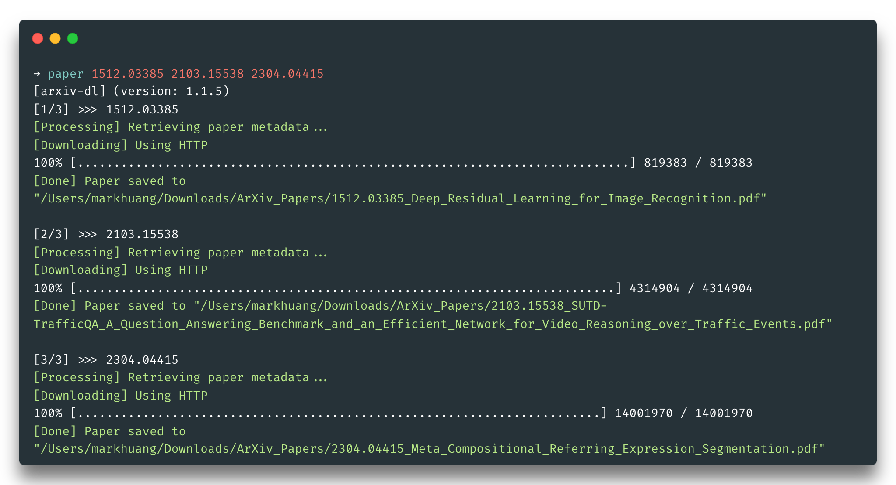

# arXiv-dl

Command-line [ArXiv](https://arxiv.org/) & [CVF Open Access](https://openaccess.thecvf.com/menu) Paper Downloader.
[[PyPI]](https://pypi.org/project/arxiv-dl/)
[[Source]](https://github.com/MarkHershey/arxiv-dl)

[](https://pypi.org/project/arxiv-dl/)
[](https://pypi.org/project/arxiv-dl/)
[](https://github.com/MarkHershey/arxiv-dl/releases)
[](https://pypistats.org/packages/arxiv-dl)
[](https://github.com/MarkHershey/arxiv-dl/blob/master/LICENSE)
[](https://github.com/psf/black)

_Disclaimer: This is a highly-opinionated command-line tool for downloading papers. It priorities ease of use for researchers. Obviously, this is not an official project._



## What does it do?

-   Support downloading papers from [ArXiv](https://arxiv.org/), [CVPR, ICCV, WACV](https://openaccess.thecvf.com/menu) via simple CLI.
-   Support downloading speedup by using [aria2](https://aria2.github.io/).
-   Retrieve the paper's metadata such as:
    -   Title, Abstract, Year
    -   Authors
    -   Comments (Conference acceptance info)
    -   Repository URLs
    -   `BibTeX` Citation
-   Automatically maintain a list of local papers and their metadata in a JSON file.
-   Configure the desired download destination via an environment variable or a command-line argument.
-   All downloaded papers will have standardized filename for easy browsing.

## Why?

-   Save time and effort to download and organize papers on your machine.
-   Speedup downloading process by using multiple parallel connections.
-   Local paper list would be handy for quick local lookup, making notes, and doing citations.

## How to install it?

This is a command-line tool, simply use `pip` to install the package globally, then you are good to go!

-   Pre-requisite: `Python 3.x`

```bash
python3 -m pip install --upgrade arxiv-dl
```

NOTE: After installation, you need to ensure the installation path is included in your PATH variable. If you encounter any difficulty finding / setting the PATH, there is this recommended way of [installing stand alone command line tools](https://packaging.python.org/en/latest/guides/installing-stand-alone-command-line-tools/), kindly follow its instruction when installing `arxiv-dl`.

Optionally, install [aria2c](https://aria2.github.io/) for download speedup.

-   MacOS: `brew install aria2`
-   Linux: `sudo snap install aria2c`

## How to use it?

After installation, you may use the command `paper` in your shell to download papers. (You may also use the `getpaper` or `arxiv-dl` command, they are all equivalent.)

```bash
$ paper [-h] [-v] [-p] [-d DOWNLOAD_DIR] [-n N_THREADS] urls [urls ...]
```

Options:

-   `-v`, `--verbose` (optional): Print paper metadata.
-   `-p`, `--pdf_only` (optional): Download PDF only without creating Markdown notes
-   `-d`, `--download_dir` (optional): Specify one-time download directory. This option will override the default download directory or the one specified in the environment variable `ARXIV_DOWNLOAD_FOLDER`.
-   `-n`, `--n_threads` (optional): Specify the number of parallel connections to be used by `aria2`.

### Usage Examples:

```bash
# Use a paper's ArXiv ID
$ paper 1512.03385

# You can download multiple papers at once
$ paper 1512.03385 2103.15538 2304.04415

# Use ArXiv URL (either abstract page or PDF page URL works!)
$ paper https://arxiv.org/abs/2103.15538

# Use ArXiv URL (either abstract page or PDF page URL works!)
$ paper https://arxiv.org/pdf/1512.03385.pdf

# Use CVF Open Access URL (either abstract page or PDF page URL works!)
$ paper "https://openaccess.thecvf.com/content/CVPR2021/html/Lin_Real-Time_High-Resolution_Background_Matting_CVPR_2021_paper.html"
```


## Configurations

### Default Download Destination

-   Without any configurations, all paper will be downloaded to `$HOME/Downloads/ArXiv_Papers`.

### Set Your Custom Download Destination _(Optional)_

You may configure your preferred download destination once and for all via an environment variable. This will override the default download destination. To do that, include the following line in your `.bashrc` or `.zshrc` file:

```bash
export ARXIV_DOWNLOAD_FOLDER="YOUR/PATH/TO/ANY/FOLDER"
```

-   Every time you use the `paper` command, the download destination will be set to the following order of priority:
    1.  Command-line option `-d`
    2.  Environment variable `ARXIV_DOWNLOAD_FOLDER`
    3.  Default download destination

### Set Custom Command Alias _(Optional)_

-   You can always set your own preferred alias to rename the command or add more options.
-   Include the following line(s) in your `.bashrc` or `.zshrc` file to set your preferred alias:
    ```bash
    alias dp="paper"
    alias dpv="paper -v -d '~/Documents/Papers'"
    ```

## Development

### Set up development environment

```bash
python3 -m venv venv && \
source venv/bin/activate && \
pip install -e ".[dev]"
```

### Run Tests

```bash
pytest
```

### Build the package

```bash
make
```

### Clean cache & build artifacts

```bash
make clean
```

## TODOs

-   [x] Add support for ara2c.
-   [x] Add support for papers on CVF Open Access.
-   [ ] Add support for papers on OpenReview.

## License

[MIT License](https://github.com/MarkHershey/arxiv-dl/blob/master/LICENSE) - Copyright (c) 2021-2024 Mark H. Huang
