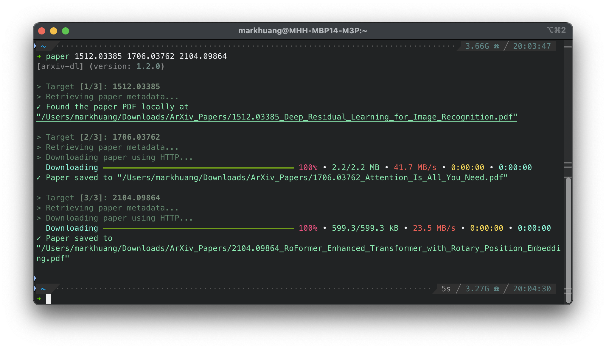

# arXiv-dl

Command-line research paper downloader for papers hosted on [arXiv](https://arxiv.org/), [NeurIPS](https://proceedings.neurips.cc/), [CVF Open Access](https://openaccess.thecvf.com/menu) (CVPR, ICCV, WACV), and [ECVA](https://www.ecva.net/papers.php) (ECCV).

[](https://pypi.org/project/arxiv-dl/)
[](https://pypistats.org/packages/arxiv-dl)
[](https://github.com/psf/black)
[](https://github.com/MarkHershey/arxiv-dl/blob/master/LICENSE)

_Disclaimer: This is an opinionated command-line tool for downloading papers. It prioritizes ease of use for researchers and is not an official arXiv project._



## What does it do?

- Downloads papers from [arXiv](https://arxiv.org/), [NeurIPS](https://proceedings.neurips.cc/), [CVPR, ICCV, WACV](https://openaccess.thecvf.com/menu), and [ECCV](https://www.ecva.net/papers.php) with a simple CLI.
- Speeds up downloads with [aria2](https://aria2.github.io/) when available.
- Retrieves paper metadata:
    - Title, abstract, and year
    - Authors
    - Comments and conference acceptance info
    - Repository URLs when available
    - `BibTeX` citation
- Maintains a list of local papers and their metadata in a JSON file.
- Lets you configure the download destination with an environment variable or command-line option.
- Saves downloaded papers with standardized filenames.

## Why?

- Save time downloading and organizing papers.
- Use multiple parallel connections for faster downloads.
- Keep a local paper list for lookup, notes, and citations.

## Installation

Install with `pip`:

- Prerequisite: Python 3.9 or later

```bash
python3 -m pip install -U arxiv-dl
```

> [!NOTE]
> After installation, make sure the Python script installation directory is on your `PATH`. If the `paper` command is not found, see this [PATH setup note](https://github.com/MarkHershey/arxiv-dl/issues/16#issue-3266539938) or the Python Packaging guide for [installing stand-alone command-line tools](https://packaging.python.org/en/latest/guides/installing-stand-alone-command-line-tools/).

Optionally, install [aria2c](https://aria2.github.io/) for multi-connection downloads.

- macOS: `brew install aria2`
- Linux: `sudo snap install aria2c`

## Usage

After installation, use `paper` in your shell to download papers.
The legacy commands `arxiv-dl` and `getpaper` are equivalent to `paper`.

```bash
paper [OPTIONS] TARGET(s)
```

### Shell examples

```bash
# Download a single target
$ paper 1512.03385

# Download multiple targets
$ paper 2103.15538 2304.04415 https://arxiv.org/abs/1512.03385
```

### Supported Targets

<details>
<summary><strong>Click to expand</strong></summary>

✅ Supported, 🚧 Not Yet Supported, ❌ Not Supported

- **[ArXiv](https://arxiv.org/)**
    - ✅ ArXiv ID: `1512.03385` or `arXiv:1512.03385`
    - ✅ Legacy ArXiv ID: `alg-geom/9708001` or `cs/0002001`, etc.
    - ✅ ArXiv Abstract Page URL: `https://arxiv.org/abs/1512.03385`
    - ✅ ArXiv PDF Page URL: `https://arxiv.org/pdf/1512.03385.pdf`
    - ✅ ArXiv HTML Page URL: `https://arxiv.org/html/2506.15442`
- **[CVF Open Access](https://openaccess.thecvf.com/menu) (CVPR, ICCV, WACV)**
    - ✅ CVF Abstract Page URL: `https://openaccess.thecvf.com/content/**/html/**/*.html`
    - ✅ CVF PDF Page URL: `https://openaccess.thecvf.com/content/**/papers/**/*.pdf`
- **[ECVA](https://www.ecva.net/papers.php) (ECCV)**
    - ✅ ECVA Abstract Page URL: `https://www.ecva.net/html/**/*.php`
    - ❌ ECVA PDF Page URL: `https://www.ecva.net/papers/**/*.pdf`
- **[NeurIPS](https://proceedings.neurips.cc/) / [NIPS](https://papers.nips.cc/)**
    - ✅ NeurIPS Abstract Page URL: `https://proceedings.neurips.cc/paper_files/paper/**/hash/**/*.html`
    - ✅ NeurIPS PDF Page URL: `https://proceedings.neurips.cc/paper_files/paper/**/file/**/*.pdf`
    - ✅ NIPS mirror Abstract Page URL: `https://papers.nips.cc/paper_files/paper/**/hash/**/*.html`
    - ✅ NIPS mirror PDF Page URL: `https://papers.nips.cc/paper_files/paper/**/file/**/*.pdf`
- **[OpenReview](https://openreview.net/)**
    - 🚧 TODO

</details>

### Common Options

- `-v`, `--verbose`: Print full details.
- `-d`, `--download-dir`: Set the download directory for this run. This overrides both the default path and `ARXIV_DOWNLOAD_FOLDER`.
- `-n`, `--n-threads`: Set the number of parallel download connections used by `aria2`.

> [!TIP]
> Run `paper -h` to see all options.

### Python API

```python
from arxiv_dl import download_paper

download_paper(target="1512.03385", download_dir=".", set_verbose_level="silent")
```

## Configuration

### Default Download Destination

- By default, papers are downloaded to `$HOME/Downloads/ArXiv_Papers`.

### Custom Download Destination

Set `ARXIV_DOWNLOAD_FOLDER` to choose a persistent download destination. Add this to your `.bashrc` or `.zshrc`:

```bash
export ARXIV_DOWNLOAD_FOLDER="YOUR/PATH/TO/ANY/FOLDER"
```

- Download destination priority:
    1.  Command-line option `-d` (highest priority)
    2.  Environment variable `ARXIV_DOWNLOAD_FOLDER`
    3.  Default download destination (lowest priority)

### Custom Command Alias

- You can define aliases to rename the command or add default options:
    ```bash
    alias dp="paper"
    alias dpv="paper -v -d '~/Documents/Papers'"
    ```

## Contributing

Development, testing, build, and publishing notes are in [DEVELOPMENT.md](DEVELOPMENT.md).

## License

This project is licensed under the [MIT License](https://github.com/MarkHershey/arxiv-dl/blob/master/LICENSE).  
&copy; Mark H. Huang. All rights reserved.
