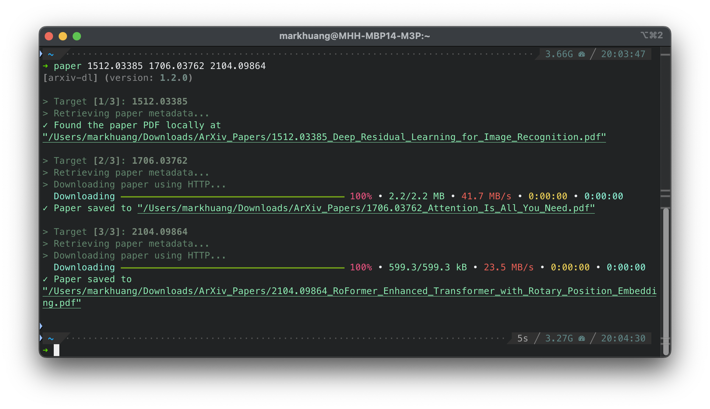

# arxiv-dl

A command-line tool for downloading, naming, and cataloging research papers from
arXiv and major paper repositories.

[](https://pypi.org/project/arxiv-dl/)
[](https://pypistats.org/packages/arxiv-dl)
[](https://github.com/psf/black)
[](https://github.com/MarkHershey/arxiv-dl/blob/master/LICENSE)

> `arxiv-dl` is an independent project and is not affiliated with arXiv.



## Features

- Accepts arXiv IDs, individual paper URLs, and supported listing or collection
  pages.See [Supported Inputs](#supported-inputs) for the complete list of supported targets.
- Saves consistently named PDFs, optional text or Markdown notes, and a local
  JSON paper index.
- Extracts available metadata such as title, authors, abstract, venue, year,
  comments, and BibTeX. Availability varies by source.
- Supports a configurable download directory and optional parallel downloads
  with [aria2](https://aria2.github.io/).

## Installation

`arxiv-dl` requires Python 3.9 or newer. Install it with
[pipx](https://pipx.pypa.io/latest/how-to/install-pipx.html) to keep it isolated
from other Python packages:

If pipx is already installed:

```console
pipx install arxiv-dl
paper --help
```

Current pipx releases require Python 3.10 or newer. If pipx is not installed,
use the setup command for your platform, restart the terminal, and then run the
commands above.

| Platform                   | Install pipx                                                      |
| -------------------------- | ----------------------------------------------------------------- |
| macOS                      | `brew install pipx`<br>`pipx ensurepath`                          |
| Debian 12+ / Ubuntu 23.04+ | `sudo apt update`<br>`sudo apt install pipx`<br>`pipx ensurepath` |
| Fedora                     | `sudo dnf install pipx`<br>`pipx ensurepath`                      |
| Windows PowerShell         | `py -m pip install --user pipx`<br>`py -m pipx ensurepath`        |

On Windows, replace `py` with `python` or `python3` if needed. See the
[pipx installation guide](https://pipx.pypa.io/latest/how-to/install-pipx.html)
for other platforms.

Upgrade an existing installation with:

```console
pipx upgrade arxiv-dl
```

<details>
<summary>Install with pip in a virtual environment</summary>

Use this method if you have Python 3.9 or prefer not to use pipx.

On macOS or Linux:

```bash
python3 -m venv .venv
source .venv/bin/activate
python -m pip install --upgrade arxiv-dl
paper --help
```

On Windows PowerShell:

```powershell
py -m venv .venv
.\.venv\Scripts\Activate.ps1
python -m pip install --upgrade arxiv-dl
paper --help
```

On Command Prompt, use `.venv\Scripts\activate.bat` instead of the PowerShell
activation command. The `paper` command is available while the virtual
environment is active.

If PowerShell blocks script activation, use the environment directly:

```powershell
.\.venv\Scripts\python.exe -m pip install --upgrade arxiv-dl
.\.venv\Scripts\paper.exe --help
```

</details>

## Usage

```console
paper [OPTIONS] TARGET [TARGET ...]
```

`arxiv-dl` and `getpaper` are alternative command names for `paper`.

### Examples

```bash
# Download one paper by arXiv ID
paper 1512.03385

# Download multiple targets
paper 2103.15538 https://arxiv.org/abs/1512.03385

# Download all papers from the current Hugging Face daily listing
paper https://huggingface.co/papers

# Choose an output directory and skip the notes file
paper 1512.03385 --download-dir ./papers --pdf-only
```

### Supported inputs

| Source                                                                       | Accepted input                                                                                    |
| ---------------------------------------------------------------------------- | ------------------------------------------------------------------------------------------------- |
| [arXiv](https://arxiv.org/)                                                  | Modern or legacy arXiv IDs; abstract, PDF, and HTML URLs                                          |
| [alphaXiv](https://alphaxiv.org/)                                            | Paper routes containing a valid arXiv ID; resolved through canonical arXiv URLs                   |
| [Hugging Face Papers](https://huggingface.co/papers)                         | Individual papers; daily, weekly, monthly, trending, user, and organization listings; collections |
| [ICLR](https://proceedings.iclr.cc/)                                         | Proceedings abstract and PDF URLs, including short-route aliases                                  |
| [NeurIPS](https://proceedings.neurips.cc/) / [NIPS](https://papers.nips.cc/) | Abstract and PDF URLs from the current proceedings or legacy NIPS site                            |
| [CVF Open Access](https://openaccess.thecvf.com/menu)                        | Abstract and PDF URLs for CVPR, ICCV, WACV, and ACCV, including workshops and findings tracks     |
| [ECVA](https://www.ecva.net/papers.php)                                      | ECCV abstract pages; direct PDF support varies by year, so prefer the abstract page               |

<details>
<summary>View detailed input formats</summary>

✅ Supported, 🚧 not yet supported, ⚠️ limited support

- **[arXiv](https://arxiv.org/)**
    - ✅ arXiv ID: `1512.03385` or `arXiv:1512.03385`
    - ✅ Legacy arXiv ID: `alg-geom/9708001` or `cs/0002001`
    - ✅ Abstract URL: `https://arxiv.org/abs/1512.03385`
    - ✅ PDF URL: `https://arxiv.org/pdf/1512.03385.pdf`
    - ✅ HTML URL: `https://arxiv.org/html/2506.15442`
- **[alphaXiv](https://alphaxiv.org/)**
    - ✅ Abstract URL: `https://www.alphaxiv.org/abs/2312.16682v2`
    - ✅ PDF URL: `https://www.alphaxiv.org/pdf/2312.16682v2`
    - ✅ Other paper routes containing an arXiv ID, including overview, HTML,
      localized, Markdown, and direct PDF asset URLs
    - alphaXiv targets resolve through the corresponding canonical arXiv URLs.
- **[Hugging Face Papers](https://huggingface.co/papers)**
    - ✅ Individual paper: `https://huggingface.co/papers/2605.12357`
    - ✅ Current daily papers: `https://huggingface.co/papers`
    - ✅ Daily papers: `https://huggingface.co/papers/date/2026-05-22`
    - ✅ Weekly papers: `https://huggingface.co/papers/week/2026-W21`
    - ✅ Monthly papers: `https://huggingface.co/papers/month/2026-05`
    - ✅ Trending papers: `https://huggingface.co/papers/trending`
    - ✅ User or organization papers: `https://huggingface.co/huggingface/papers`
    - ✅ Collection: `https://huggingface.co/collections/Testerpce/memory`
- **[CVF Open Access](https://openaccess.thecvf.com/menu)** (CVPR, ICCV, WACV,
  ACCV)
    - ✅ Abstract URL: `https://openaccess.thecvf.com/content/**/html/**/*.html`
    - ✅ PDF URL: `https://openaccess.thecvf.com/content/**/papers/**/*.pdf`
    - ✅ Workshop and findings-track URLs
- **[ECVA](https://www.ecva.net/papers.php)** (ECCV)
    - ✅ Abstract URL:
      `https://www.ecva.net/papers/eccv_<year>/papers_ECCV/html/<paper>.php`
    - ⚠️ Direct PDF support varies by year; prefer the abstract URL.
- **[NeurIPS Proceedings](https://proceedings.neurips.cc/) / [NIPS legacy site](https://papers.nips.cc/)**
    - ✅ NeurIPS abstract URL:
      `https://proceedings.neurips.cc/paper_files/paper/**/hash/**/*.html`
    - ✅ NeurIPS PDF URL:
      `https://proceedings.neurips.cc/paper_files/paper/**/file/**/*.pdf`
    - ✅ NIPS abstract URL:
      `https://papers.nips.cc/paper_files/paper/**/hash/**/*.html`
    - ✅ NIPS PDF URL:
      `https://papers.nips.cc/paper_files/paper/**/file/**/*.pdf`
- **[ICLR Proceedings](https://proceedings.iclr.cc/)**
    - ✅ Abstract URL:
      `https://proceedings.iclr.cc/paper_files/paper/**/hash/**/*-Abstract-Conference.html`
    - ✅ PDF URL:
      `https://proceedings.iclr.cc/paper_files/paper/**/file/**/*-Paper-Conference.pdf`
    - ✅ Short `/paper/**` routes and `-Abstract.html` aliases, normalized to the
      canonical HTTPS `-Conference` URLs
- **[OpenReview](https://openreview.net/)**
    - 🚧 Not yet supported

</details>

### Options

| Option                     | Description                                                                                                         |
| -------------------------- | ------------------------------------------------------------------------------------------------------------------- |
| `-d`, `--download-dir DIR` | Set the directory for this run; overrides the environment variable and default.                                     |
| `-p`, `--pdf-only`         | Download the PDF without creating a notes file.                                                                     |
| `--notes-format {txt,md}`  | Set the notes format (default: `txt`).                                                                              |
| `-n`, `--n-threads N`      | Request 1–16 download connections (default: `1`). Values above 1 use aria2 when available; CVF uses one connection. |
| `-v`, `--verbose`          | Show full details.                                                                                                  |
| `--verbose-level LEVEL`    | Set output to `silent`, `minimal`, `default`, or `verbose`.                                                         |
| `--skip-update-check`      | Skip the package update check.                                                                                      |

Run `paper --help` for the full command reference.

### Faster downloads with aria2

[aria2](https://aria2.github.io/) is optional. Install it, ensure `aria2c` is on
your `PATH`, and request more than one connection:

| Platform           | Install aria2                             |
| ------------------ | ----------------------------------------- |
| macOS              | `brew install aria2`                      |
| Debian / Ubuntu    | `sudo apt install aria2`                  |
| Fedora             | `sudo dnf install aria2`                  |
| Windows PowerShell | `winget install --exact --id aria2.aria2` |

```console
paper --n-threads 5 1512.03385
```

## Configuration

Papers are saved to `~/Downloads/ArXiv_Papers` by default
(`%USERPROFILE%\Downloads\ArXiv_Papers` on Windows). Use `--download-dir` for a
single run or set `ARXIV_DOWNLOAD_FOLDER` for a persistent default.

On macOS or Linux, add this to `.bashrc`, `.zshrc`, or the relevant shell
profile:

```bash
export ARXIV_DOWNLOAD_FOLDER="$HOME/Documents/Papers"
```

Reload the shell profile or open a new terminal for the change to take effect.

On Windows PowerShell, set a persistent user environment variable and open a new
terminal:

```powershell
[Environment]::SetEnvironmentVariable("ARXIV_DOWNLOAD_FOLDER", "$HOME\Documents\Papers", "User")
```

The resolution order is `--download-dir`, `ARXIV_DOWNLOAD_FOLDER`, then the
default directory.

## Python API

```python
from arxiv_dl import download_paper

download_paper(
    target="1512.03385",
    download_dir=".",
    set_verbose_level="silent",
)
```

## Contributing

See [DEVELOPMENT.md](https://github.com/MarkHershey/arxiv-dl/blob/master/DEVELOPMENT.md)
for development, testing, build, and release instructions.

## License

[MIT](https://github.com/MarkHershey/arxiv-dl/blob/master/LICENSE) © 2021–2026
Mark H. Huang.
